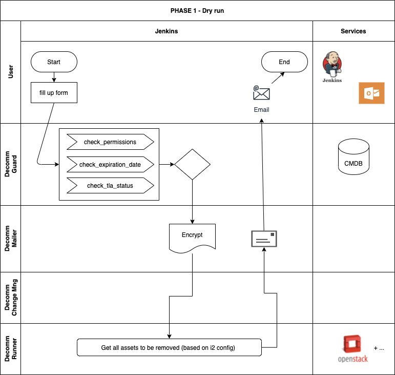
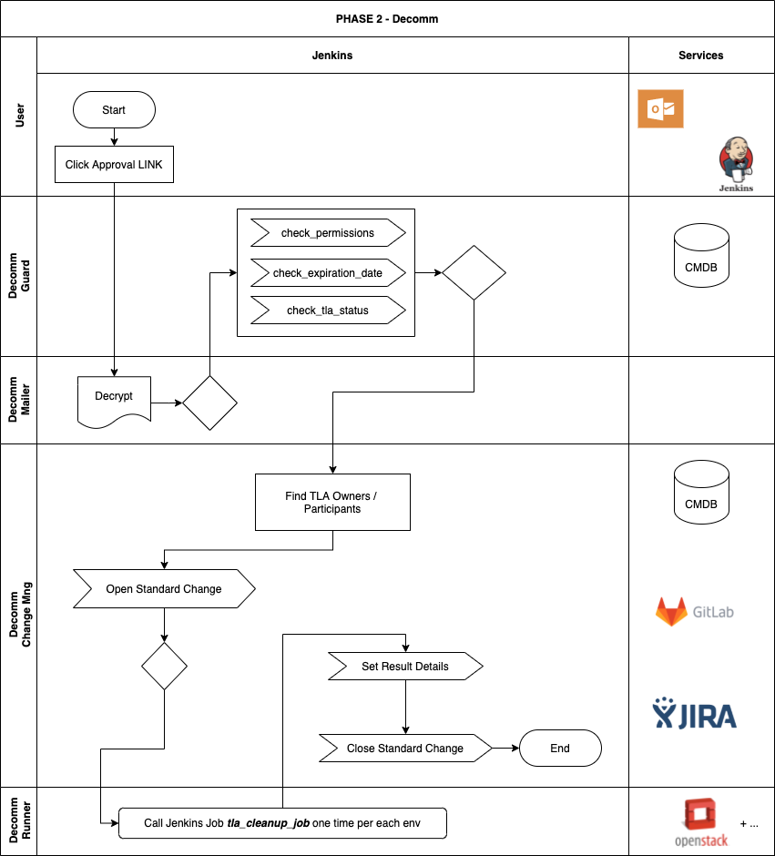

TLA Full Decommission Job
=================================

[[_TOC_]]

---

## Summary

This job deletes all resources associated with a TLA, and it is designed to run
in 2 phases:

### Phase 1 - Dry Run

Triggered manually in Jenkins UI, by providing the TLA name and some optional
notification emails - this step will produce an email with a preview of the
resource to be deleted and a link to approve/confirm the decommissioning



### Phase 2 - Decommission

By clicking in the approval link in the email, the job will effectively execute
the listed deletions. This includes a set of guard rails and a change
management workflow.



---

## Related docs

### Official How-to (for end users)

https://confluence.app.betfair/display/hashbang/Full+decommission+of+a+TLA

## Action plan

https://confluence.app.betfair/display/i2Program/Action+Plan

### Requirements and considerations

https://confluence.app.betfair/display/i2Program/TLA+Full+Decommission+Job

---

## Technical how-to

### Within a Jenkins Job

Because it's not required to have an "isolated repo", one needs to clone the
repo the configured path
```tla_decommission/var/scm/i2_config_isolated_repo/${TLA_NAME}```.

If no code is found on that folder, the job will assume it's not an isolated
repo TLA.

e.g.:

```yaml
    builders:

      - shell: |
          echo "Trying to get TLA isolated repo (if exists)"
          rm -rf i2_config_isolated_repo
          git clone git@gitlab.app.betfair:i2/${TLA_NAME} tla_decommission/var/scm/i2_config_isolated_repo/${TLA_NAME} || true

      - shell: |
          cd tla_decommission
          ./jenkins_builder.sh
```

Current existing [Jenkins Job Definition](https://gitlab.app.betfair/devops/jenkins_job_builder/-/blob/master/tla_cleanup.yml).

### Environment variables required

See ```jenkins_builder.sh``` for the default assignments.

* `TLA_NAME ` -
* `NFS_VOLUMES ` -
* `REQUEST_HASH ` -
* `APPROVAL_ENCRYPTION_KEY ` -
* `ADDITIONAL_RECIPIENTS ` -
* `JENKINS_ENDPOINT ` -
* `JENKINS_WEBHOOK_TOKEN ` -
* `JENKINS_JOB_NAME ` -
* `JENKINS_USERNAME ` -
* `JENKINS_TOKEN ` -
* `CMDB_TYPE ` -
* `CMDB_ENDPOINT ` -
* `CMDB_USERNAME ` -
* `CMDB_PASSWORD ` -
* `ISSUE_TRACKER_TYPE ` -
* `ISSUE_TRACKER_ENDPOINT ` -
* `ISSUE_TRACKER_USERNAME ` -
* `ISSUE_TRACKER_PASSWORD ` -
* `SCM_TYPE ` -
* `SCM_URL ` -
* `SCM_TOKEN ` -
* `OSP10_USERNAME ` -
* `OSP10_PASSWORD ` -
* `BUILD_USER_ID ` -
* `BUILD_USER_EMAIL ` -
* `LOGGER_OVERRIDE ` -

---

### Logger

A dedicated logger for jenkins is configured at ```logging.yml``` and global
logger name overwritten for the jenkins job using ```LOGGER_OVERRIDE```
variable.

```yaml
# logging.yml
...
jenkins:
  format: '%(levelname)s - %(module)s - %(message)s'
...
loggers:
  jenkins:
    level: INFO
    handlers: [ jenkins_console ]
    propagate: no
...
root:
  level: INFO
  handlers: [ console ]
```

## Contributing

### Create environment
```bash
# create a new virtual environment
make virtualenv

# prepare the local environment
make dev-build
```
If you're using pycharm, you need to mark "sources" folder in order for the
imports to work as in the package, instead of "src.toolkit".

### CA Toolkit

This project extensively uses `catoolkit` package, you can see detailed
[documentation here](https://gitlab.app.betfair/hashbang/ca-toolkit/-/blob/master/README.md).


### All available commands
```bash
> make
Please use `make <target>' where <target> is one of
  clear                     Clears the existing build files
  dev-build                 Prepares the local environment
  dev-update                Updates the local environment dependencies
  install                   Install all requirements and project
  test-coverage             Generates the coverage reports
  test                      Run the tests
  virtualenv-clear          Deletes the current virtual enviroment
  virtualenv                Creates a new virtual environment

```

# known limitations

## Jenkins remote trigger mechanism

### BUILD_USER variables
When the job is remotely triggered the variables BUILD_USER_* are not filled
in (jenkins plugin). This means one cannot check match between who asked for
the job with who clicked the link. This is not critical because the mailbox is
personal and not shared.

### Blank page after approval
Also, when triggering a jenkins job remotely a blank page is returned, meaning
the job was started (jenkins doesn't allow to change this page).
This can be misleading for the average user and to mitigate this issue several
messages have been posted throughout the process to warn the user that this is
expected behavior.

In a future version we should create a confirmation page with an informational message.
